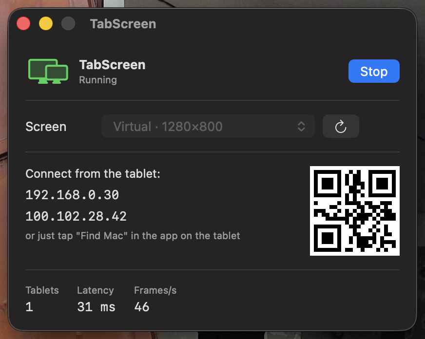

# TabScreen

**Turn an old Android tablet into a second display for your Mac.**
About 33 ms of lag over Wi-Fi. No subscription, no cables, no developer mode.



spacedesk only ships a Windows server. Sidecar only talks to iPads. Duet wants a yearly
fee. If you have a MacBook and an Android tablet gathering dust in a drawer, this is the
missing piece.

## Install

Two downloads from the [Releases](https://github.com/BreraDMR/tabscreen/releases) page.
No terminal, nothing to build.

**1. Install [BetterDisplay](https://github.com/waydabber/BetterDisplay)** on the Mac —
the free version is enough. It creates the virtual screen; macOS has no public API for
that, so no app can do it alone.

**2. Unpack `TabScreen-mac.zip`** and drag `TabScreen.app` to Applications.
Open it with **right-click → Open** the first time — the app isn't signed with a paid
Apple certificate, so a plain double-click gets blocked. Allow screen recording when
macOS asks.

**3. Press "Create virtual screen."** TabScreen sets one up through BetterDisplay,
1280×800, ready to go.

**4. On the tablet, open `tabscreen-android.apk`** — download it straight to the tablet
with its browser. Android will ask to allow installing from this source. That's the whole
setup on that side: no developer mode, no adb, no USB.

**5. Press "Turn on."** The tablet finds the Mac on the network by itself. If your network
blocks that, the app shows its address and a QR code — type it in on the tablet.

Now drag any window onto the new screen and it appears on the tablet.

## What to expect

Measured on a MacBook Air M1 and a **Samsung Galaxy Tab A 10.1 from 2019** — 2 GB of RAM,
a decoder from that era. Newer hardware does better; nearly all the remaining delay is the
tablet decoding the picture.

| | |
|---|---|
| Lag | **31–36 ms** |
| Frame rate | 45–60 fps |
| Mac CPU | 2 % of one core |
| Network | ~5 Mbit/s |

For comparison: the obvious way to build this — screen recording piped into a browser —
gives 200–500 ms and feels awful. [How it got to 33 ms](docs/HOW-IT-WORKS.md).

## When something goes wrong

**"The app won't open, macOS says it's damaged or from an unidentified developer."**
Right-click the app → Open → Open. This is macOS's standard treatment of apps without a
paid certificate, not a sign of anything wrong.

**The tablet says "Looking for a Mac" forever.** Both devices need to be on the same
Wi-Fi, and guest networks usually block devices from seeing each other. Type the address
shown in the TabScreen window instead.

**The tablet shows a black screen.** The Mac is capturing the wrong display — check the
"Screen" dropdown, the virtual one is labelled *Virtual*. If there's no virtual screen in
the list, press "Create virtual screen".

**"BetterDisplay isn't responding."** Start BetterDisplay by hand and wait until its icon
appears in the menu bar, then try again.

**The picture is smooth but lags behind.** Something else is eating your Wi-Fi, or the
tablet is far from the router. A USB cable is an option for the stubborn cases — see
[dev/](dev/README.md) — but it needs developer mode on the tablet and buys only a few
milliseconds.

**The tablet itself is sluggish, not the picture.** Old Android tablets spend their RAM on
preinstalled software. `tools/debloat.sh` turns off the usual suspects — nothing is
deleted, `tools/rebloat.sh` puts it all back. That one does need adb.

## Building it yourself

Only if you want to change something.

```bash
git clone https://github.com/BreraDMR/tabscreen
cd tabscreen
./setup.sh     # builds the Mac app, fetches a JDK + Android SDK into ./tools, builds the APK
```

Nothing is installed system-wide and no password is asked for. The Android client is
~450 lines of Java, the Mac app ~700 lines of Swift, and the APK comes out at 20 KB.

- [How it works and why it's fast](docs/HOW-IT-WORKS.md) — the architecture, the four
  fixes that mattered, and the measurements
- [KNOWN-GOOD.md](KNOWN-GOOD.md) — every setting of the configuration that produced these
  numbers, plus what was tried and made things worse
- [dev/](dev/README.md) — earlier Python and ffmpeg iterations, kept for debugging

## Limits

- **Touch isn't wired up.** There's a working implementation in `dev/input.py`, but at any
  noticeable lag a finger-driven cursor feels wrong.
- **BetterDisplay is required** for the virtual screen. No way around it on macOS.
- **The app is unsigned** — first launch needs right-click → Open.
- macOS 13+ and Android 8+.

## License

MIT
